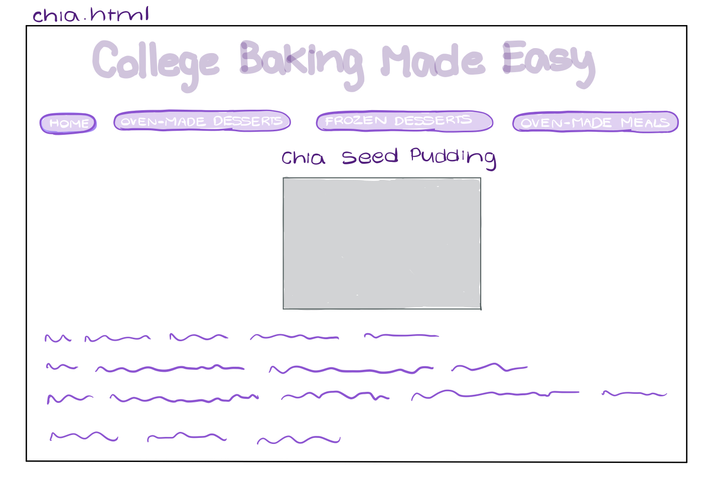
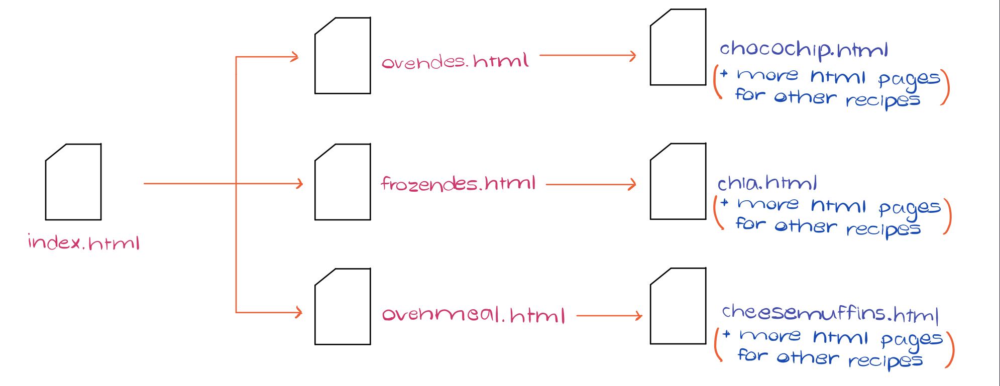

# Project 1 - Design Journey

**For each milestone, complete only the sections that are labeled with that milestone.**

## Markdown Instructions

This is a Markdown file. All written documents that you will submit this semester will be Markdown files. Markdown is a commonly used format by developers and bloggers. It's something that you should know.

The following links are Markdown references:
- <https://guides.github.com/features/mastering-markdown/>
- <https://github.com/adam-p/markdown-here/wiki/Markdown-Cheatsheet>

When writing your Markdown file in Atom. Open the command palette and search for **Markdown Preview: Toggle**. This will open up a panel in Atom where you can preview your formatted Markdown file.

This is how your insert images into your Markdown documents:

## Milestone 1

**Make the case for your decisions using concepts from class, as well as other design principles, theories, examples, and cases from outside of class.**

You can use bullet points and lists, or full paragraphs, or a combo, whichever is appropriate. The writing should be solid draft quality but doesn't have to be fancy.

### Website Topic (Milestone 1)

[Briefly explain what your website will be about.] My website will be a baking guide for college students, featuring recipes that involve ingredients that are easy for students to find and use.

### Target Audience (Milestone 1)

[Briefly explain who the intended target audience(s) is for your website. Be specific and justify why this audience is appropriate for your site's topic.] College students (especially sophomores, juniors and seniors) interested in baking foods using minimal ingredients that are easy to find on a college campus. This audience is appropriate for my baking website as the recipes featured will only involve ingredients that are easy to find on campus (such as bananas, flour, sugar, all available at Jansen's Market on West Campus). I am most specifically targeting sophomores, juniors and seniors as they are more likely to have an oven available for their use in their apartments or dorms.

### Final Content (Milestone 1)

[Briefly describe the content you plan to include in the final site, and why it's the right content for your audiences.] My content will involve recipes that will need a small set of ingredients, all of which would be easy to find or to purchase on college campuses (especially at Cornell University). The content will feature images of the finished product, and simple step-by-step baking instructions. The main aim of this website is to make baking a simple and fun pass-time for college students who would like to enjoy simple, homemade food on a low budget.

### Home Page Content (Milestone 1)

[Briefly identify what content you will include on the homepage and why this content should be the first thing your target audience sees when they visit your site.]

My home page will include some images of baked goods that will attract users to the site. The website will also include a navigation bar featuring titles of each of the types of recipes available to create (oven-made desserts, frozen desserts, oven-made meals), so that users can select their favorite and start baking. The frozen desserts option will allow students who do not have access to an oven to create meals without heating (puddings, ice creams, etc). The oven-made meals option gives students who want to create something savory some options (pasta bake, casserole, etc).

---

## Milestone 2

**Make the case for your decisions using concepts from class, as well as other design principles, theories, examples, and cases from outside of class.**

Each section is probably around 1 reasonably sized paragraph (2-4 sentences).

### Target Audience (Milestone 2)

[A clearer description of audience: who are they, what are they interested in with respect to this site, and what are the design goals for that audience.] My audience involves college students (particularly Sophomores, Juniors and Seniors) interested in baking in their free time, with ingredients that are easy to find around their college campus themselves. As a student at Cornell University myself, I would say that this website is more specifically for students at Cornell as I am more aware of what is available in stores that can be used to bake in the recipes featured on the website. I am most specifically targeting sophomores, juniors and seniors as they are more likely to have an oven available for their use in their apartments or dorms. My goal for the design is to ensure that the website is easy to navigate. My navigation bar categorizes the recipes based on whether they are sweet, savoury, require an oven or not.

### Organization & Navigation (Milestone 2)

[A description of how you generated and considered alternatives for the site's content organization and navigation. You are required to include images here of your card sorting for determining the organization of content and the navigation.] I began thinking about the website's navigation by categorizing food as foods that need an oven to make, and foods that do not need an oven to make (allowed the site to be inclusive of students who did not have an oven). I also thought about whether I should sort the recipes based on chocolate foods and non-chocolate foods, but later I came up with the idea of also including savory foods in the website so that students can make meals rather than just desserts using an oven. I eventually decided to form three categories: oven-made desserts, frozen desserts, and oven-made meals. This categorization makes it easy for users to choose whether they want to make something sweet or savory, and within that category, decide whether they can use an oven or not. An image of the overall sorting of my website is provided below.

[Thoroughly document this process. The _process_ is the important part of this assignment, not the final result.]

### Final Organization and Navigation (Milestone 2)

[Explain how the final organization of content and navigation is appropriate for your target audiences.] My three categories, featured in the navigation bar of my website, are: oven-made desserts, frozen desserts, and oven-made meals. This categorization makes it easy for users to choose whether they want to make something sweet or savory, and within that category, decide whether they can use an oven or not. For example, if John is a freshman who wants to make something sweet but doesn't have access to an oven, he can select the "frozen desserts" option on the navigation bar to be directed to a web page of images and links to recipes of his interest.

---

## Milestone 3

**Make the case for your decisions using concepts from class, as well as other design principles, theories, examples, and cases from outside of class.**

Remember to focus on the things we can't see just by looking at the site: changes, alternatives considered, processes, and justifications.

Each section is probably around 1 reasonably sized paragraph (2-4 sentences).

### Theme Ideas (Milestone 3)

[Discuss several ideas about styling your site's theme. Explain why the theme ideas are appropriate for your target audiences. Feel free to include some hand-drawn sketches (not digital drawings, not mock-ups, not wireframes, etc.) here to document your design process.] Initially, I was thinking of going form warm tones such as red and orange for the text, with a clean white background. This is because I read that warm tones tend to make people hungrier, which is perfect for the purpose of the website - to make people hungry and ready to bake! However, I realized that the warm tones may be too warm when compounded with the baking images on the website, which are also warm. I then thought about the opposite -  cool blues in order to make the images of the baked goods pop. However, I realized from lab 3 that adding light blue tones can give the website a very professional and strict feel. As my audience is primarily college students, I hoped to welcome people to the site in a way that is calming and warm rather than professional. Therefore, I have decided to theme my website with light lavenders, purples and greys. This way, not only will the images of the baked goods pop, but also the text and the clean white background will add a welcoming, relaxing feel to the design. An image of my idea is attached below. For the two themes, I experimented with the purple and grey theme (theme1.css) and the blue professional theme (theme2.css).

### Theme Design (Milestone 3)

[Discuss your theme designs: how did you come to them, what are their strengths and weaknesses, how do they fit your overall design goals and audiences?] My theme designs are mainly based on thinking about the relationship between color and mood. The mood I am going for with my website for college students is welcoming and relaxing, in a way that makes the images pop when users come to the main screen so that they are tempted to make the creations that they see in front of them. I first thought about reds and oranges to generate feelings of hunger, but then realized they would be too strong when my aim was to relax the user and calm them down, so that they can live in the moment and bake with their friends rather than stress about upcoming prelims and assignments. Then, I thought about blues and greys. They definitely will make the images pop, but will leave the website looking very professional, and in a sense, very dry and unenjoyable. I later realized that a light purple - like lavender would be perfect as not only is it welcoming and relaxing, but it is also a muted color that will let the baked goods on the screen pop. The grey will add to the simplicity of the website, making it seem easy to navigate and neat to look at.

[Emotion is a big part of design. What emotions where you thinking about or trying to convey in your designs?]
I want students to think that baking is a relaxing, fun thing to do with friends in college. College can be a very stressful time, especially when prelims and assignments constantly come upon you. However, unwinding with some baking would be a great way for students to enjoy with their friends while also taking their mind off of their stress. Therefore, I was hoping that the website is easy to read, calming and welcoming to users. The ease of reading is succeeded by using a clean, block font on a white background. I am also thinking of making the titles grey to add to the simplicity of the design. The calming and welcoming feel is contributed to with the lavender color scheme, which also perfectly complements the warm tones of the baked goods, making them stand out on the screen.

---

## Final Submission - Rationale

**This rationale should be polished writing: one you might submit as a report to a client or boss to help explain the project and convince them you did a good job. You'll be surprised how much writing and communicating you need to do about projects and choices on internships and jobs; practice that here.**

It should be a comprehensive, complete story of the project. You might find that each section runs a few paragraphs (1-2). Sketches can often help tell the story of your design. Screenshots are also useful for describing issues discovered during the design process and how you addressed them.

Your rationale should be a polished version of the earlier explanations.

### Site Layout (Final Submission)

[Show your design process and final layout for your site. You must include photos of your sketches of the layout. No digital drawings permitted.]
The image of each web page is attached below.

### Audience (Final Submission)

[A complete and polished description of the intended audience(s) for your website.]
My audience involves college students (particularly Sophomores, Juniors and Seniors) interested in baking in their free time, with ingredients that are easy to find around their college campus. As a student at Cornell University myself, I would say that this website is more specifically for students at Cornell as I am more aware of what is available in stores that can be used to bake in the recipes featured on the website. I am most specifically targeting sophomores, juniors and seniors as they are more likely to have an oven available for their use in their apartments or dorms.

### Design Goals (Final Submission)

[An explanation of the design goals for that audience, based on your earlier rationales.]
I want students to think that baking is a relaxing, fun thing to do with friends in college. College can be a very stressful time, especially when prelims and assignments constantly come upon you. However, unwinding with some baking would be a great way for students to enjoy with their friends while also taking their mind off of their stress. Therefore, I was hoping that the website is easy to read, calming and welcoming to users. The ease of reading is succeeded by using a clean, block font on a white background. The calming and welcoming feel is compounded by the use of lavender and white tones in the first theme, and the use of blue and grey tones in the second theme. The color schemes also complement the warm tones of the images of the food, therefore making the images pop whilst also keeping the website minimalist and easy to read.  

### Navigation (Final Submission)

[An explanation of how the final navigation met your goals and why its appropriate for your audience(s).]
I began thinking about the website's navigation by categorizing food as foods that need an oven to make, and foods that do not need an oven to make (allowed the site to be inclusive of students who did not have an oven). I came up with the idea of also including savory foods in the website so that students can make meals rather than just desserts using an oven. I eventually decided to form three categories: oven-made desserts, frozen desserts, and oven-made meals. This categorization makes it easy for users to choose whether they want to make something sweet or savory, and within that category, decide whether they can use an oven or not. An image of the overall sorting of my website is provided below.

### Organization (Final Submission)

[An explanation of how the final organization met your goals and why its appropriate for your audience(s).]
The website's pages are organized based on whether the foods are sweet or savory, and whether they require an oven or not. This categorization makes it easy for users to choose whether they want to make something sweet or savory, and within that category, decide whether they can use an oven or not.  The website is organized as it opens with the homepage. The navigation bar stands out on this page, attracting users to choose the type of meal/dessert they would like to make. After clicking on the menu option of choice, they are taken to a webpage with a list of titles and images of potential foods they can make based on the navigation category selected. Once they select the food of choice to make, they are taken to a new webpage focused specifically on that food and the recipe to make it. Therefore, the site is organized well for my audience as it narrows down details based on wider categories first (eg. oven/no oven) and then allows users to select a specific recipe of interest at the end of their journey through the site.

### Visual Design (Final Submission)

[An explanation of how the final design met your goals and why its appropriate for your audience(s).]
The final design is simplistic, welcoming and well-organized, therefore succeeding all of the categories I was hoping to fulfill for my audience. As my audience (Cornell University students) is likely to come to this website when stressed, I ensure that the colors (blues and purples) allow for them to feel calm as they look through the site. The categorization, based mainly on how the food will be cooked and its flavor, is very simple to understand, and allows users to easily move through the site and find their recipe of choice. The clean font style makes everything easy to read, while the images not only attract users to the site, but also compel them to create the food that they see on screen.

### Self-Reflection (Final Submission)

[What did you learn from this assignment? What are some of your strengths and weaknesses?]
I learned a lot about website organization and clarity through this project. As this is my first ever complete website design using HTML and CSS, I learned a lot about how to organize code and use a small amount of well-structured files to fulfill the requirements of an entire project. I had a lot of fun working on this project as it involved the freedom of creating a website and design targeted towards a specific group of people. After this project, I have learned that my strengths include learning how to embed new tags and attributes to my code quickly and seamlessly. I am also good at organizing my code in a way that uses less space and is also easy to navigate through and understand. I think a weakness of mine is creating a design that I will stick to throughout the project process. Every time I look at my webpage, I am compelled to add new designs or features in order to enhance it, which may not be very important for the project, and could make the website more complex for audiences to use than it should be.
